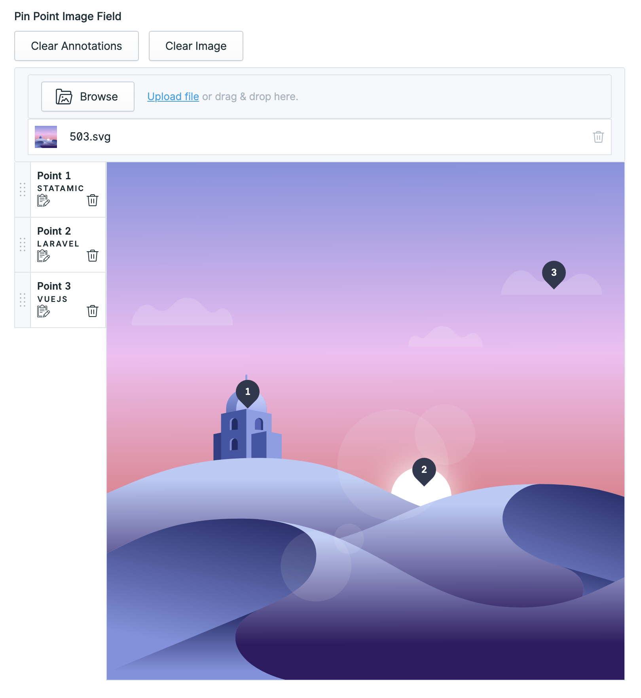

# Pinpoint Image

> Pinpoint image is a Statamic addon that does something pretty neat. Oh yes, thats right, we need to explain that bit.
> Right then, It allows you to create your own pinpoint image fieldtype! 
> 
> hmmmm, that still does not explain it, does it?
> 
> Perhaps an image, people like pictures, here is how the fieldtype looks in your cp admin:



## Features

This addon does:

- Allows you to add your own pinpoint image fieldtype (which was wonderfully described above)
- Add an image to the field
- Pin each point with text on each point
- Output the field data to the frontend with a handy tag ```{{ pinpoint_image :field="pinpoint_image_field" }}``` (:field= is the name of the field handle when you create the field in blueprint)
- Edit the outputted field on the frontend


## License
Pinpoint image requires a license to be used while on a production site.
You can purchase one at https://statamic.com/addons/weareframework/pinpoint-image.

You may use Pinpoint image without a license while developing locally.

## How to Install

You can search for this addon in the `Tools > Addons` section of the Statamic control panel and click **install**, or run the following command from your project root:

``` bash
composer require weareframework/pinpoint-image
```

## Things to note
The field utilises the asset field type to grab an image so ensure you've picked a container for the field e.g. assets

## How to Use

Install it, use it, let your site have fun with it

This can be used within Antlers using the product_color_swatch tag:

```twig
{{ pinpoint_image :field="pinpoint_image_field" }}
```
```:field=``` is the name of the field handle when you create the field in blueprint

by default it outputs this:


You can hover on each point to get your text you typed in the cp admin.

## Templating

Pass field to the `pinpoint_image` tag.

```twig
{{ pinpoint_image :field="pinpoint_image_field" }}
```

This will render a default pinpoint_image tag with the default output as shown above. Nice

## Customizing the generated html

If you want to customize the generated html, you can publish the views using

```bash
php artisan vendor:publish
```
and choosing `Weareframework\PinpointImage\ServiceProvider`


This will create the file template to overwrite at the following path: 
```statamic-install-site-name/resources/views/vendor/pinpoint-image/tags/index.blade.php```

Hopefully it makes sense for you to edit it!
